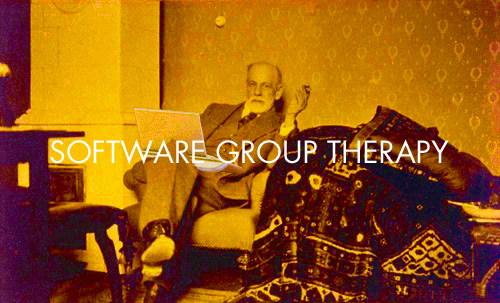



## First meeting

Dear junior and not-so-junior scientists,

* You use and write software all day and are frustrated because you would
like to do science instead?

* You feel like you are reinventing the wheel and that there must be a
better way or a better tool?

* You just need to talk about your software problems to other people
instead of banging your head all alone against the screen?

We want to start a hopefully regular meeting for software group therapy.

Bring along your software problems and we will talk about them and try
to find solutions together.

Beer and chips will be provided courtesy of [Technologit.de](http://www.technologit.de).

Come on down to the PC Pool in Haus 2 of the BCCN <http://is.gd/PCPool>
on Thursday, December 6th, at 17:00!

Your Software Therapists,
Rike and Tiziano

### Sponsored by

